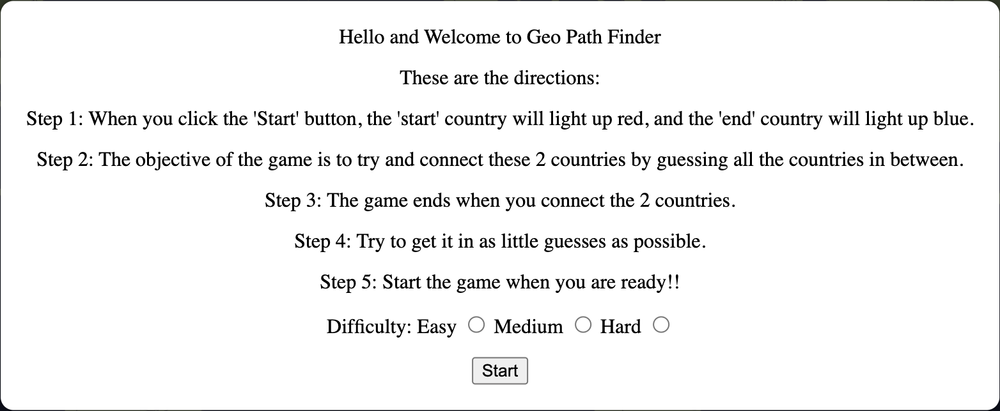
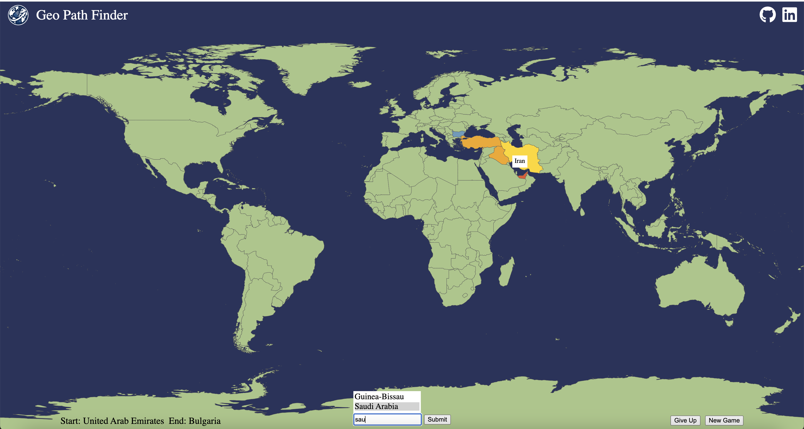
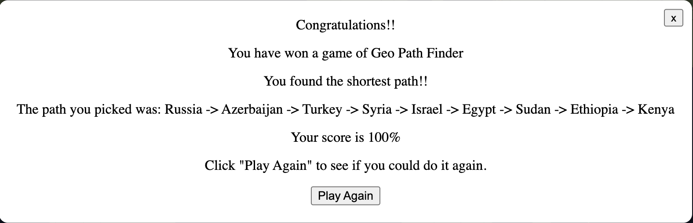

## Geo Path Finder

## Description

- Geo Path Finder is an engaging geography puzzle game that challenges users to find the shortest path between two countries on a map. The objective is to guess the names of countries that form a continuous path between the given starting and ending countries. Countries are considered connected if they share a border. As users make guesses, the countries on the map change color to indicate their location, and the country names are revealed. The game ends when a complete path is found between the two initial countries. After completion, the game provides users with the optimal path to compare their solution.

## Functionality

-Welcome page
    *Upon loading, users are greeted with a welcome page.
    *The welcome page includes game instructions, a difficulty setting (easy, medium, hard), and a "Start Game" button to begin.

-Gameplay
    *The main game screen displays an interactive map with labeled countries.
    *In the center of the screen, there's a text input box for users to enter country names. The input box offers autocomplete suggestions in alphabetical order as users type, disappearing when no matches are found.
    *Users can either click on a suggestion or type the answer and press "Enter" to submit.
    *As countries are guessed, they appear in a distinctive color (e.g., yellow) on the map, and their names are shown.
    *The starting and ending countries are displayed on the bottom-left of the screen.

-Buttons
    *"Give Up" reveals the correct path on the map in black, along with a pop-up summary of the correct route.
    *"New Game" returns users to the initial welcome screen for a fresh game.


- Welcome page that renders upon loading.


- Example of what the path looks like. Shows the buttons, start and end countries, and the input box with autocomplete. Also display the th hover effect when hovering over a country.


- Example of what pops up on the screen when the game is over.

## Libraries, APIs

- The game fetches data from two sources: world atlas data for country geometry and Rest Countries API for country information: https://cdn.jsdelivr.net/npm/world-atlas@2/countries-10m.json and https://restcountries.com/v3.1/all?fields=name,ccn3,cca3,borders,independent


```js 
    function shortestPathBFS(mergedData, startCountryName, endCountryName) {
    const startCountry = mergedData.find(country => country.restCountriesInfo && (country.restCountriesInfo.name.common || country.restCountriesInfo.name.official) === startCountryName);
    const endCountry = mergedData.find(country => country.restCountriesInfo && (country.restCountriesInfo.name.common || country.restCountriesInfo.name.official) === endCountryName);

    const queue = [[startCountry]];
    const visited = new Set();

    while (queue.length > 0) {
        const path = queue.shift();
        const currentCountry = path[path.length - 1];

        if (currentCountry.restCountriesInfo.cca3 === endCountry.restCountriesInfo.cca3) {
            return path;
        }

        visited.add(currentCountry.restCountriesInfo.cca3);

        const borderingCountries = getBorderingCountries(mergedData, currentCountry);

        for (const border of borderingCountries) {
            if (border && !visited.has(border.restCountriesInfo.cca3)) {
                const newPath = [...path, border];
                queue.push(newPath);
            }
        }
    }
    return null;
}

function getBorderingCountries(mergedData, currentCountry) {
    return (currentCountry.restCountriesInfo?.borders || []).map(borderCca3 => {
        return mergedData.find(country => country.restCountriesInfo?.cca3 === borderCca3);
    });
}
```

```js
function getRandomCountries(mergedData) {
  const independentCountries = mergedData.filter(country => {
    const restCountriesInfo = country.restCountriesInfo;
    return restCountriesInfo?.independent === true && restCountriesInfo.borders.length > 0;
  });

  const randomCountries = [];

  while (randomCountries.length < 2) {
    const randomIndex = Math.floor(Math.random() * independentCountries.length);
    const randomCountry = independentCountries[randomIndex];

    if (randomCountry && randomCountry.properties && randomCountry.properties.name) {
      randomCountries.push(randomCountry.properties.name);
      independentCountries.splice(randomIndex, 1);
    }
  }

  return randomCountries;
}

function countryList(mergedData) {
  const independentCountries = mergedData.filter(country => {
    const restCountriesInfo = country.restCountriesInfo;
    return restCountriesInfo?.independent === true && restCountriesInfo.borders.length > 0;
  });
  return (independentCountries.map(country => country.restCountriesInfo.name.common));
}

export { getRandomCountries, countryList };
```
- Function that picks 2 random countries by looking at the mergedData and ensuring that the countries from the database are not islands, are independent, and the common name matches the official name.

```js
async function merge() {
  const worldAtlasData = await fetch('https://cdn.jsdelivr.net/npm/world-atlas@2/countries-10m.json').then(res => res.json());
  const restCountriesData = await fetch('https://restcountries.com/v3.1/all?fields=name,ccn3,cca3,borders,independent').then(res => res.json());

  const countryPropertyMap = {
    "Macedonia": "North Macedonia",
    "S. Sudan": "South Sudan",
    "Côte d'Ivoire": "Ivory Coast",
    "Dominican Rep.": "Dominican Republic",
    "eSwatini": "Eswatini",
    "Bosnia and Herz.": "Bosnia and Herzegovina",
    "Eq. Guinea": "Equatorial Guinea",
    "Dem. Rep. Congo": "Democratic Republic of the Congo",
    "Vatican": "Vatican City",
    "Congo": "Republic of the Congo",
    "Central African Rep.": "Central African Republic",
  };

  worldAtlasData.objects.countries.geometries.forEach(country => {
    const newName = countryPropertyMap[country.properties.name];
    if (newName) {
      country.properties.name = newName;
    } else if (country.properties.name === "Kosovo") {
      country.id = "383";
    }
  });

  restCountriesData.forEach(country => {
    if (country.name.common === "Kosovo" || country.name.common === "Palestine" || country.name.common === "Taiwan" || country.name.common === "Zambia") {
      country.independent = true;
    }
    if (country.name.common === "Kosovo") {
      country.ccn3 = "383";
    }
    if (country.name.common === "DR Congo") {
    country.name.common = "Democratic Republic of the Congo"; 
    }
    if (country.name.common === "United States") {
      country.name.common = "United States of America"; 
    }
    if (country.name.official === "Republic of Chad") {
      country.name.official = "Chad"; 
    }
  });

  const restCountriesMap = {};
  restCountriesData.forEach(country => {
    restCountriesMap[country.ccn3] = country;
  });

  return worldAtlasData.objects.countries.geometries.map(geometry => {
    const ccn3 = geometry.id;
    if (restCountriesMap[ccn3]) {
      return {
        ...geometry,
        restCountriesInfo: restCountriesMap[ccn3]
      };
    } else {
      return geometry;
    }
  });
}

export default merge;
```
- Function that merges the 2 databases together through the id of one and the cca3 of the other.

- One of the 3 BFS I needed to implement in the code. It takes in the mergedData which likely represents the geography of the world with information about country borders and other attributes. It takes the start and end countries and search through the data to find the country objects based on their names. In the country object, the border information indicates which countries share a border with the current country and I use this data to initiate a BFS traversal by adding the start country to the queue. I explore neighboring countries and add them to the queue, continually expanding the search. The BFS continues until it reaches the end country, at which point its found the shortest path.

- 1 of other 2 BFS' I use figure out if two randomly selected countries have a linear path between them. This is a way to ensure that it's possible to reach one country from the other through bordering countries without backtracking.

- The last one is used to determine whether the path inputted by the user creates a different path than the shortest path. his is a way to validate the user's input and identify if they have found an optimal route.

# Futute Implementations

    *Transform the 2D map into a 3D globe for a more immersive experience.
    *Implement a zoom feature to focus on the area containing the start and end countries.
    *Enhance the visual design, including pop-up boxes, buttons, and input elements.
    *Add blinking glow effects to countries once the game is successfully completed.
    8Address any cross-browser compatibility issues to ensure consistent display.